# canvas mode

canvas is the third base scene of the [custom runtime](RUNTIME.md) — the right-hand button on the
device, or `PUT /api/v1/scene {"base":"canvas"}`. it is the one scene nothing on the device draws
by itself: an integration pushes a **document** of drawing primitives and the device renders it, so
the integration can send data rather than 2,496 bytes of raw rgb.

every picture on this page is a photograph of the panel. they were captured off `GET /screen` by
`runtime/tools/tc002-canvas-docs.py`, which drives the device through this same catalogue — so the
documents below and the images of them cannot drift apart. the panel is **52 × 16 pixels**; the
images are scaled six times, nearest-neighbour, so a panel pixel is a visible square.

for the api itself — routes, fields, limits, the patch format, what is stored and when — see the
[canvas section of `RUNTIME.md`](RUNTIME.md#the-canvas). this page is the visual counterpart: what
the primitives actually look like on the glass.

---

## the shape of a document

a document is a list of elements. push it once, then send only the values that change:

```bash
curl -sX PUT http://10.0.0.111/api/v1/canvas -H "Authorization: Bearer $ADMIN" -d '{
  "elements": [
    {"type":"text","at":[0,0],"font":"mini","colour":"506070","text":"amsterdam"},
    {"id":"t","type":"text","at":[0,5],"font":"block","colour":"ffffff","text":"9"},
    {"id":"g","type":"sparkline","at":[28,11],"size":[24,5],"style":"bars","colour":"205070",
     "min":0,"max":100,"data":[40,45,50,60,55,50,45]}
  ]}'

# and afterwards, only the readings — no pixels, no layout
curl -sX PATCH http://10.0.0.111/api/v1/canvas -H "Authorization: Bearer $CONTROL" \
  -d '{"values":[{"id":"t","text":"11"},{"id":"g","data":[45,50,60,70,65,60,55]}]}'
```


that layout is 361 bytes sent once; each update after it is about 70. the elements that change
carry an `id`, and the ones that never change do not need one.

---

## text

### the four faces

`small` is 5 × 7 and has every printable character. `mini` is 3 × 5 and carries letters and digits —
it is the face the device's own menus use. `block` (6 × 10) and `big` (10 × 14) carry **digits and a
colon only**, for a number you read across a room.

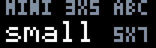

| face | size | characters | a full line |
|---|---|---|---|
| `small` | 5 × 7 | all printable ascii | 8 characters |
| `mini` | 3 × 5 | letters and digits | 13 characters |
| `block` | 6 × 10 | digits and `:` | 7 characters |
| `big` | 10 × 14 | digits and `:` | 4 characters |

a character costs its width plus one pixel of gap (two for `big`), so "a full line" above is how
many fit across 52 pixels. anything longer is clipped — or [scrolled](#scroll).

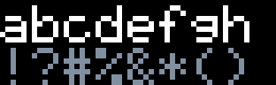
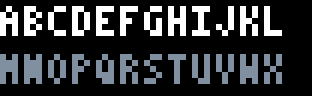

### numerals

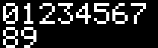
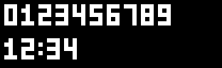

`block` and `big` exist for one job: a reading that has to be legible from across the room. they
carry `0`–`9` and `:` and nothing else, so a `deg` or a `kW` beside them comes from `small` or
`mini`.

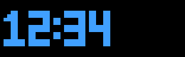
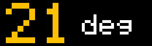

### alignment

give a text element a `size` and it becomes a box: `align` places the string inside it, and
anything that does not fit is cut off at the box edge rather than running over its neighbour.

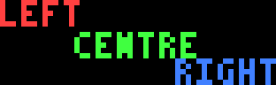

---

## the drawing primitives

### rect

`filled` decides between an outline and a solid block. without a `size` a rect takes the rest of
the panel.

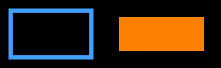

### line

`at` is one end, `to` is the other. lines are drawn with a bresenham walk, so a steep line is a
line rather than two dots.

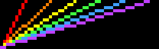

### circle

`at` is the centre and `r` the radius; `filled` again decides between a ring and a disc.

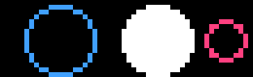

### pixel

one lit point. the primitive everything else is made of, and occasionally the one you want.

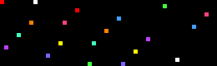

### bar

a value from 0 to 100 in its box, with an optional `background` for the empty part. `vertical`
fills from the bottom, which is where a level belongs.

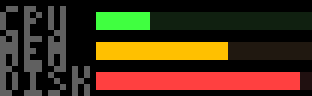
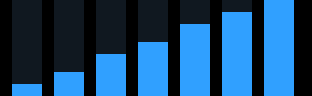

### sparkline

up to 52 samples — one per panel column. three styles, and the same data in each:

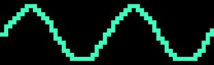
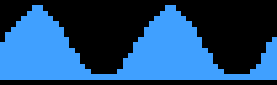
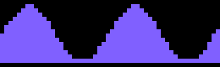

with no `min` and `max` a sparkline scales to whatever its samples span, so a flat line is flat.
give it a range and two charts become comparable. a `threshold` recolours the samples that cross
it:

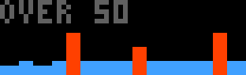

samples can also be sent as `data_hex`, which costs two characters each instead of up to four.

### icon

sixty-one 8 × 8 glyphs built into the runtime. they are monochrome and take the element's
`colour`, which is why they suit a panel where the palette belongs to the document rather than to
the artwork. `GET /api/v1/icons` lists them on the device.

| | |
|---|---|
| 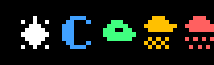 | `sun` `moon` `cloud` `cloud-rain` `cloud-snow` |
| 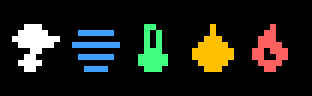 | `storm` `fog` `thermometer` `droplet` `flame` |
| 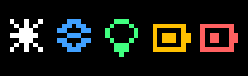 | `snowflake` `fan` `bulb` `battery-full` `battery-half` |
| 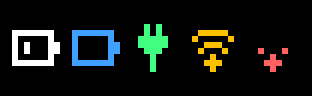 | `battery-low` `battery-empty` `plug` `wifi` `wifi-low` |
| 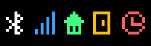 | `bluetooth` `signal` `house` `door` `clock` |
| 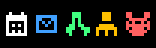 | `calendar` `envelope` `phone` `person` `pet` |
| 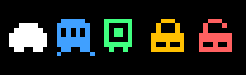 | `car` `train` `bus` `lock` `unlock` |
| 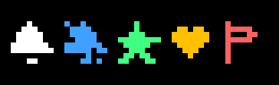 | `bell` `bell-off` `star` `heart` `flag` |
| 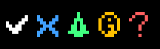 | `check` `cross` `warning` `info` `question` |
| 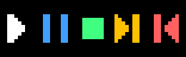 | `play` `pause` `stop` `next` `previous` |
| 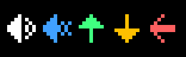 | `volume` `mute` `up` `down` `left` |
| 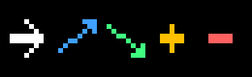 | `right` `up-trend` `down-trend` `plus` `minus` |
|  | `dot` |

### sprite

anything that needs colours of its own is a sprite: 8 × 8 or 16 × 16 of raw rgb888, uploaded as
octets to `PUT /api/v1/sprites/<id>` and drawn by id. **black is transparent**, so a sprite can sit
over something else. eight slots, and they survive a renderer restart.

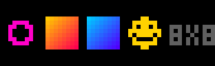
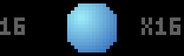

the ring is the one to look at: the panel shows through its middle because those pixels are black.

### tile

the composite an integration reaches for first, and the one place the device makes a layout
decision for you. a tile is a glyph, a label and a reading. given room it puts the glyph on the
left with the label over the value; where there is not room the label is **dropped** rather than
squeezed or cut off, and the reading — the half worth keeping — stays.

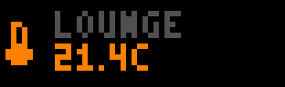
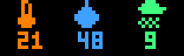
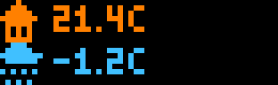

a `PATCH` value replaces a tile's reading and never its label: the reading is the part that
changes, the label is layout.

---

## placement

`at: [x, y]` and `size: [w, h]` are pixels from the top-left. `tile: n, of: m` divides the panel
into columns and `row: n, of: m` into rows — the device does the rounding, so the pieces meet
exactly with no gap and no overlap (52 does not divide by three).

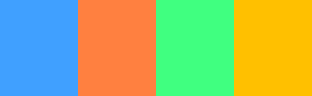
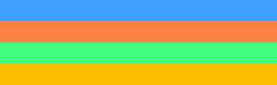

a box is not only a position: it aligns what is inside it and cuts off what is not.

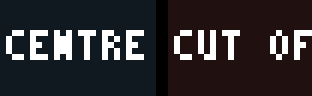

elements draw in the order they are given, so the last one wins where they meet. that is what lets
a document build up in layers — ground, then chart, then labels on top.

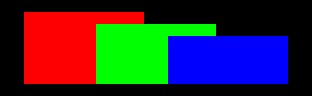
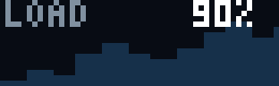

anything may be placed off the panel and what fits is drawn. that is deliberate: it is what lets an
element be animated in from outside.

---

## animations

an animation is declared per element, so a document pays for motion only where it asked for it —
a scene of static elements asks the renderer for no frames at all once it has settled. `ms` is the
period, and `phase` (0–100) offsets an element within it, so a row of things does not move in
lockstep.

### hue

the colour walks the wheel from whatever the element was given as its starting point.

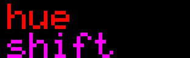

### pulse

brightness rides up and down, never quite to nothing.


### blink

on for its duty cycle, dark for the rest. `amount` is the duty as a percentage.

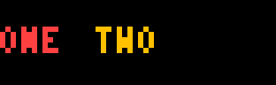

### bounce

up and down by `amount` pixels, or across with `axis: "x"`.

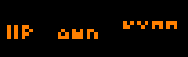
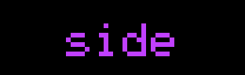

### scramble

the flipboard: each character settles out of flipping glyphs, left to right, and then stops. an
arrival animation — it runs once when the value arrives rather than forever.

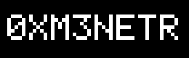

### typewriter

a character at a time, then it holds. also an arrival animation.


### scroll

for text too wide for its box: a pixel every `ms`, wrapping once it has left.

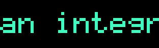

### sweep

a sparkline draws itself in from the left, and starts again whenever its data changes.

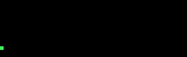

### together

each element runs on its own clock, so a document mixes them freely.

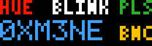

### matching the phase elsewhere

the device starts a document's animations when it installs it, and a document says nothing about
when it was said. so `GET /canvas` publishes an `age_ms` for the document **and** for each element
— a `PATCH` restarts only the elements whose value actually changed — and a second renderer of the
same document back-dates its own install by those ages to draw the phase the panel is drawing. the
console's preview does exactly that.

---

## trying it

the demo reels in `runtime/tools/` play every one of these on the device, and print what each step
costs:

```bash
runtime/tools/tc002-demo-shapes.py     -s 10.0.0.111 --token-file tokens
runtime/tools/tc002-demo-text.py       -s 10.0.0.111 --token-file tokens
runtime/tools/tc002-demo-charts.py     -s 10.0.0.111 --token-file tokens
runtime/tools/tc002-demo-icons.py      -s 10.0.0.111 --token-file tokens
runtime/tools/tc002-demo-images.py     -s 10.0.0.111 --token-file tokens
runtime/tools/tc002-demo-layout.py     -s 10.0.0.111 --token-file tokens
runtime/tools/tc002-demo-tiles.py      -s 10.0.0.111 --token-file tokens
runtime/tools/tc002-demo-dashboard.py  -s 10.0.0.111 --token-file tokens
```

each takes `--hold`, `--only`, `--list` and `--loop`, and each puts back the scene **and the
canvas** it found. `tc002-demo-lint.py` checks every document all eight would send — the limits,
the fields, and where the ink actually lands — without a device.

to regenerate every image on this page:

```bash
runtime/tools/tc002-canvas-docs.py -s 10.0.0.111 --token-file tokens
```

it needs `ffmpeg` on the machine running it, for the gifs only — the stills go through a twenty-line
png encoder at the bottom of that file. that is the one tradeoff here: quantising a hue sweep to a
256-colour palette by hand would be a worse use of the repository than a dependency in a
documentation script.
