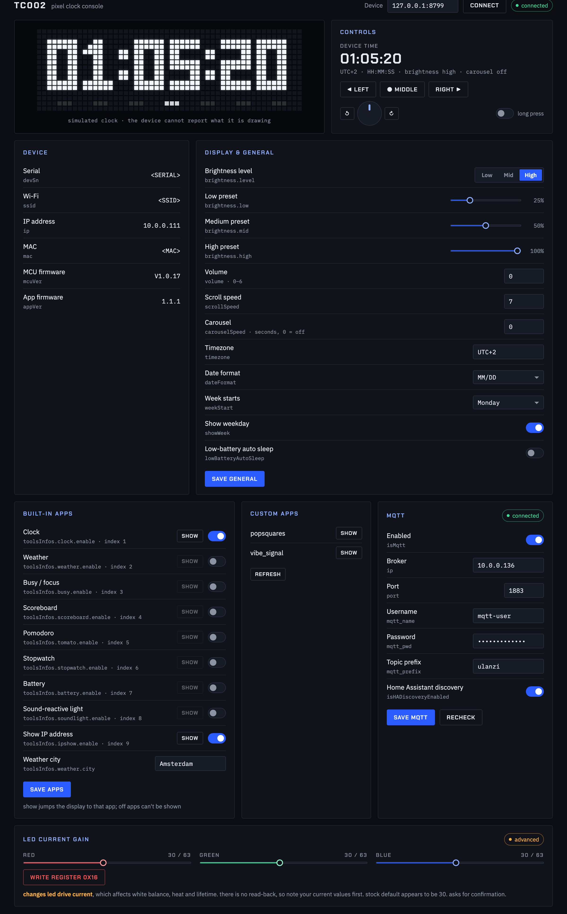
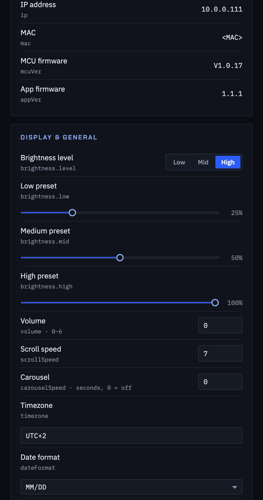

# tc002-customisation

customising and controlling the [ulanzi tc002](https://www.ulanzi.com/en-eu/products/tc002-pixbar-smart-pixel-clock-ii)
pixel clock over its local network, without the ulanzi studio desktop app.

the tc002 runs linux on a sigmastar ssd21x soc and exposes an unauthenticated
http api on port 80 plus root `adbd` on port 5555. everything here talks to
those directly, so you can set the device up, control it, and drive the display
without installing anything from ulanzi.

## what's here

docs, one topic each:

| doc | what it covers |
|-----|----------------|
| [`HTTP-API.md`](HTTP-API.md) | the local http api on port 80: conventions, cors behaviour, and every endpoint with its request fields, response shape, error messages and how it was established |
| [`DEVICE.md`](DEVICE.md) | living with the device: the stripped busybox, root adb, flashing and recovery, and how it keeps time. the hardware inventory itself is in this readme under [hardware](#hardware) |
| [`SETUP.md`](SETUP.md) | the setup-ap, discovery and adoption flow that replaces ulanzi studio |
| [`CLOUD.md`](CLOUD.md) | what the device sends to ulanzi's cloud, how it authenticates, and why that's a problem |
| [`MQTT.md`](MQTT.md) | driving the 52×16 display over a broker you control |
| [`CUSTOM-APP.md`](CUSTOM-APP.md) | the custom-app frame payload shared by http and mqtt: text, draw primitives, bitmaps, gifs, lifecycle |
| [`LED-SPI.md`](LED-SPI.md) | how the led matrix is really driven (spidev0.0 + a gpio latch, 3072-byte frames), how to take it over, and the native 60 fps renderer in `led/` |
| [`SECURITY.md`](SECURITY.md) | every security observation in one place, with mitigations |

tools:

| file | what it is |
|------|-----------|
| [`tc002-adopt.py`](tc002-adopt.py) | discover tc002 devices on the lan and join a factory-fresh one to wifi — replaces ulanzi studio for setup |
| [`panel/`](panel/) | an english web control panel for the device (the stock ui is chinese-only) |
| [`mqtt-check.py`](mqtt-check.py) | verify mosquitto broker credentials from the raw mqtt connack code |
| [`led/`](led/) | popsquares generative art running on the device at 60 fps, straight to the panel over spi — static armv7 binary built with zig, plus an adb start/stop wrapper |

related: [pixdeck](https://github.com/cailurus/PixDeck) is a working stock-firmware
client for the custom-app protocol over both http and mqtt — its `pixbar_core.py`
and `plugins/` are the source for most of [`CUSTOM-APP.md`](CUSTOM-APP.md).

## quick start

everything uses apple's `/usr/bin/python3` deliberately — see
[the local network gotcha](#a-note-on-macos) below.

**find a device already on your wifi**

```bash
/usr/bin/python3 tc002-adopt.py discover
```

it listens for the device's own udp broadcast (port 55555, about once a
second) and confirms over http, so it answers in a few seconds. from another
vlan, or if your ap filters broadcasts, it falls back to a subnet sweep
(`--no-listen --subnet 10.0.0` forces that).

**control it in english**

```bash
cd panel && /usr/bin/python3 serve.py 8777
# open http://127.0.0.1:8777  (override the target with ?host=<device-ip>)
```

the page finds the device by itself: `serve.py` listens for the udp/55555
broadcast in the background and the page picks the address up from it (or
offers a list if there are several; **find** re-checks). `--no-discover`
turns that off, and the address can always be typed. the panel covers
display/general settings, mqtt (with live connection status),
the nine built-in apps (enable, and jump to any that's on), custom apps, the
physical buttons and knob, and led current-gain calibration behind a
confirmation. a 52×16 preview at the top simulates the clock face the way the
device draws it, honouring the timezone, time format, week-start and weekday
settings; the firmware has no way to report what it is actually showing. it
reads current values and merges edits into the full object before posting, so
unshown fields are preserved. type is loaded from google fonts and falls back
to system faces offline.





(screenshots are against a stand-in device, so the serial, mac and ssid read as
placeholders. the host field accepts `host:port`, which is how the stand-in
was pointed at.) `serve.py` serves the page and proxies
`/api/<device-ip>/<endpoint>` through to the device, so the browser only ever
talks to its own origin: the device only returns cors headers on preflights
and 404s, never on real 200 responses, so a browser can't read from it directly
and a plain `http.server` will not work (see the
[cors note](HTTP-API.md#http-api)).

**adopt a factory-fresh device**

a device with no stored wifi credentials hosts a wpa2 ap called `U-Clock` and
serves `192.168.1.x`. join that network, then:

```bash
/usr/bin/python3 tc002-adopt.py adopt --ssid <your-wifi>
```

the full flow is in [`SETUP.md`](SETUP.md).

**verify your mqtt broker credentials**

```bash
/usr/bin/python3 mqtt-check.py <broker-ip> 1883
```

prompts for the password with echo off so it never reaches a transcript or
shell history. `code=0` means valid. note that mosquitto returns `5` (not
authorized) rather than the spec's `4` for bad credentials, so treat `5` as
"wrong username/password".

## what's been established

the device:

- **soc / os** — sigmastar ssd21x, 2 × cortex-a7 at 1 ghz, 64 mb dram (~35 mb
  for linux), 32 mb spi nor, linux 4.9.84, squashfs root. the app layer is the
  flythings stack (`zkdaemon` / `zkdisplay` / `zkgui`). full inventory under
  [hardware](#hardware); shell and flashing in [`DEVICE.md`](DEVICE.md)
- **http api (port 80, no auth)** — read/write of every setting via json
  endpoints (`getConfig`/`setConfig`, `getMqttConfig`/`setMqttConfig`,
  `getToolsConfig`, `getCalendar`, `getSocial`, `setWifiConfig`,
  `setLedRegister`, and destructive `update`/`resetConfig`), plus the display
  itself via `api/custom` / `api/customList`, and remote navigation via
  `switchApp` / `switchDiyApp` / `keyEvent` — no broker needed.
  ([`HTTP-API.md`](HTTP-API.md))
- **adb (port 5555)** — wifi only (usb is mass-storage); gives a **root** shell,
  though busybox is stripped to almost nothing and `/data` is the only
  persistent writable mount. ([`DEVICE.md`](DEVICE.md))
- **mqtt** — the other way to drive the 52×16 display without ulanzi studio;
  custom-app topic `[prefix]/custom/[app]` with the same `{duration,text,image,draw}`
  payload as `api/custom`. ([`MQTT.md`](MQTT.md), [`CUSTOM-APP.md`](CUSTOM-APP.md))
- **setup / discovery** — factory-fresh devices come up as the `U-Clock`
  softap on `192.168.1.1`; `POST /setWifiConfig` joins them to a network. once
  joined, the device broadcasts `Ulanzi TC002 <tail>:<mac>:<serial>:<flag>` to
  udp/55555 every second, which is how ulanzi studio finds it.
  ([`SETUP.md`](SETUP.md))
- **time** — no rtc; the app's own sntp client steps the clock from four
  hardcoded chinese ntp ips at boot and about every 2 h. no api to set it, but
  `adb shell date -s` works. ([`DEVICE.md`](DEVICE.md#time))
- **cloud** — the device registers itself with `api.ulanzistudio.com` over
  plain http and keeps a per-device secret key plus a bearer/refresh token pair
  in `setting.ini`. weather, social counts, calendars and the update check all
  go through that api, and caldav credentials are sent to it for server-side
  fetching. ([`CLOUD.md`](CLOUD.md))

security caveats worth knowing before you put one on your main network: no auth
on anything, writes forgeable from any web page you visit (the device ignores
`Origin`), root adb with no pairing, the wifi psk stored in cleartext in a
world-readable file on the device, and all cloud traffic (calendar passwords
included) sent unencrypted. an isolated iot vlan/ssid is the sensible
home for it. full detail in [`SECURITY.md`](SECURITY.md).

## hardware

everything below was read off a running unit (`/proc`, `/sys`, the device
tree, the kernel command line, module and firmware listings, and strings in
the app library) unless marked *spec*, which means ulanzi's product page.
the case was not opened.

### compute

| | |
|---|---|
| soc | sigmastar **ssd21x** ("pioneer3" family, chip id `0xf5` rev 1, board string `PIONEER3 SSC021A-S01A-S`). the firmware calls it `ssd21x_ulanzi_I008` |
| cpu | **2 × arm cortex-a7** (armv7-a, part `0xc07` r0p5), neon, vfpv4, lpae, smp |
| clock | **1.0 ghz fixed**: the device tree has a single operating point (1 000 000 khz @ 1.0 v) and no cpufreq driver is bound. core vid selects 0.9 v / 1.0 v |
| dram | **64 mb in-package**, 62 mib mapped to the kernel. of that, 24 mib is reserved for sigmastar's media heap (`mma_heap`) and 3 mib for a framebuffer, leaving **~35 mib for linux** (`MemTotal` 36 240 kb). ~14 mib is free with the stock app running |
| load | the stock app keeps the two cores at a load average of about 3 while idle, so there is little headroom for anything running alongside it |
| thermal | no thermal zone or temperature sensor is exposed |
| kernel | linux 4.9.84 smp preempt, build #1624, compiled 2026-05-27 with openwrt gcc 9.1.0. console on `ttyS0` at 115200 (whether pads are reachable was not checked) |
| platform | flythings v2.1 ("zkos") from zkswe, easyui 2.4.0, system 2.6.2, build `20260527` git `b8c8ecf`. app `1.1.1`, mcu `V1.0.17` |

### storage

**32 mib spi nor flash**, one chip, eight partitions. no nand, no emmc (the
soc has controllers for both; the nand node is disabled and nothing is on
the emmc bus). there is no sd slot: the soc's single sd/mmc slot is
configured for sdio and carries the wi-fi chip. the "tf card" in the
flythings sdk docs refers to zkswe's dev boards, not this device; the empty
`/mnt/extsd` mount point is a leftover from that sdk.

| mtd | name | size | filesystem | mounted |
|----:|------|-----:|------------|---------|
| 0 | `BOOT0` | 320 kib | bootloader (ipl) | — |
| 1 | `KERNEL` | 1.9 mib | kernel image | — |
| 2 | `rootfs` | 4.3 mib | squashfs, read-only | `/` (3.5 mib used, full) |
| 3 | `res` | 8 mib | squashfs, read-only | `/res` (2.8 mib: app library, web ui, fonts, bt tools) |
| 4 | `config` | 704 kib | squashfs, read-only | `/config` (kernel modules, board ini) |
| 5 | `MISC` | 256 kib | raw | — (pq/fbdev config read at boot) |
| 6 | `data` | 8 mib | **jffs2, read-write** | `/data` (340 kib used; the only persistent writable space) |
| 7 | `UDISK` | 8.5 mib | vfat, read-only from linux | `/mnt/storage` (holds `update.img`; this is what the usb-c port exposes as a drive) |

everything else (`/tmp`, `/dev`, `/mnt`, `/misc`) is tmpfs, 16 mib max each.

### display

| | |
|---|---|
| panel | **52 × 16 = 832 rgb leds**, square pixels, white-balanced by a per-channel current-gain register (`0x16`, 0–63, default 30) in the led driver |
| controller | a **separate pixel mcu** (firmware `V1.0.17`, protocol class `PixelMcuProto`) sits between the soc and the leds. the soc never touches the leds directly |
| frame path | soc → **spi0** (`sstar,mspi`, dma, `/dev/spidev0.0`, mode 0, 10 mhz) → mcu, with **`GPIO_35`** as a frame latch. a frame is 3072 bytes (16 rows × 192), ~2.5 ms on the bus; the stock app caps at one frame per 15 ms (~66 fps). the mcu double-buffers, so the panel lags one frame. full detail in [`LED-SPI.md`](LED-SPI.md) |
| control path | soc ↔ mcu over **uart1** (`/dev/ttyS1`, 115200 / 9600). commands seen in the app: `queryMcuVersion`, `queryBatteryPower`, `queryUsbState`, `queryMicValue`, `setAutoMicReport`, `powerOff`, `queryLedRegister`, `setLedRegister`, plus a handshake + crc32 block-upload path (`updateMcu`) for reflashing the mcu |
| gain read-back | the mcu supports `queryLedRegister`; only the http layer lacks a read endpoint |
| unused | the soc's own display pipeline is still alive from the flythings sdk: `/dev/fb0` (640 × 480, 32 bpp, "spilcd"), an hdmi-tx node, a pwm backlight node and a vsync interrupt firing constantly, all driving nothing |

### wireless

| | |
|---|---|
| chip | **aicsemi aic8800dc** wi-fi + bluetooth combo (driver `aic8800_fdrv` / `aic8800_bsp`, firmware `fmacfw_*_8800dc_h_u02`) |
| wi-fi | 2.4 ghz only (*spec*), over **sdio** (id `c8a1:c08d`, `aicwf_sdio` on `mmc0`). `wpa_supplicant` with `nl80211`; a `p2p0` interface also exists. station mode normally; ap mode (`hostapd` + `dnsmasq`) for setup |
| bluetooth | ble 5.2 (*spec*), over **uart** (`/res/bin/hciattach -n ttyS3 aic` → `hci0`). a gatt server binary ships in `/res/bin`; what it advertises was not explored |
| ethernet | the soc has a mac (`emac0`); disabled, no phy |

### inputs

| | |
|---|---|
| knob | rotary encoder on **gpio 10 / 11** (edge interrupts `knob_a` / `knob_b`, driver `zkswe,ssd-knob`, input device `knob_key`) |
| buttons | **four polled gpio keys** (20 ms poll, active-low): gpio 31 (`up`), 32 (`down`), 33 (`left`), 34 (`right`), reported as arrow keys. the app maps them to left / middle / right and the knob press. the soc's matrix-keypad block is disabled |
| microphone | present; the app reads a **level** from the mcu (`queryMicValue` / `setAutoMicReport`) for the sound-reactive app. the soc's own mic input is configured in the device tree but is not what the app polls |
| adc | the soc's sar adc is enabled; what it measures was not established |

### audio

speaker driven by the soc's audio block (`sstar,audio`, `mi_ao`, dma) with an
**amplifier-enable on gpio 9**. volume is 0–6 in the api. there is no alsa; the
sigmastar mi api is used instead.

### power

| | |
|---|---|
| battery | 3.7 v, **3600 mah, 13.32 wh** li-ion (*spec*); up to 2 h at maximum brightness (*spec*) |
| charging | **usb-c, 5 v ⎓ 3 a** (*spec*), or the pogo-pin charging dock (*spec*) |
| monitoring | done by the mcu: the app polls pack millivolts and `vin` (usb present). firmware thresholds: **low battery below 3600 mv**, **emergency below 3550 mv** → 30 s countdown → shutdown (skipped while on usb power) |
| usb | the soc has both an ehci **host** (with `vold` ready to mount a stick at `/mnt/usb1`, used for factory-test configs) and a device controller (`Sstar-udc`, msb250x). in normal use the port presents the `UDISK` partition as mass storage, not adb |
| rtc | **none usable**: the soc's rtc block is enabled in the device tree but no driver is bound, so there is no `/dev/rtc` and the clock is set purely by sntp ([`DEVICE.md`](DEVICE.md#time)) |

### also on the soc, unused

i2c0 / i2c1 (disabled), spi1 (disabled), a camera pipeline (csi / isp / vif,
enabled by the sdk, no sensor), a watchdog (enabled), and a second uart.

### physical (*spec*)

20.5 × 3.3 × 8.5 cm, about 380 g (421 g with the dock), pc plastic, with a
1/4-inch tripod thread. the dock is 19.7 × 3.1 × 1 cm. the box holds the
clock, the dock and a usb-c cable.

## a note on macos

on macos 15+ (sequoia), local network privacy gates lan access **per binary**.
apple's own binaries (`/usr/bin/curl`, `/usr/bin/python3`, `/sbin/ping`,
`/usr/bin/nc`) are exempt; homebrew- and third-party-installed binaries
(including a properly signed `adb`) are blocked until the **terminal app** is
granted permission, and the denial surfaces as a misleading network error,
never a permission error:

| tool | symptom |
|------|---------|
| `adb connect` | `failed to connect to '<ip>:5555': No route to host` |
| `nmap` | `Host seems down` / all ports `filtered (host-unreach)` |

that split is the diagnostic: if `/usr/bin/curl` works and
`/opt/homebrew/bin/nmap` does not, it is the permission, not the network. it is
also why the tools here call `/usr/bin/python3` explicitly.

**fix:** system settings → privacy & security → local network → enable your
terminal app, then **fully quit and relaunch it** (the permission is evaluated
at process launch; a new tab is not enough).

```bash
open "x-apple.systempreferences:com.apple.preference.security?Privacy_LocalNetwork"
```

## status

- discovery, the control panel, the mqtt checker, and all documented read
  endpoints are **verified against a live device**.
- the `adopt` / `setWifiConfig` write path is documented from the firmware's own
  setup page but **not executed** here, since it would drop the test device off
  the network. confirm it against a factory-fresh unit before relying on it.

## disclaimer

unofficial, reverse-engineered from a device on the local network and from the
ulanzi studio installer. not affiliated with or endorsed by ulanzi. the http api
and adb access it relies on are undocumented and may change or break in a
firmware update. you are responsible for what you do to your own hardware —
`resetConfig`, `update`, and `setLedRegister` in particular can disrupt or
degrade the device. recovery to factory firmware is holding the reset button
during power-up.

## references

- [UlanziTechnology/Ulanzi-U-Clock-TC002](https://github.com/UlanziTechnology/Ulanzi-U-Clock-TC002)
- [FlyThings ADB docs](https://zkswe.github.io/flythings-doc/en/adb_debug.html)
