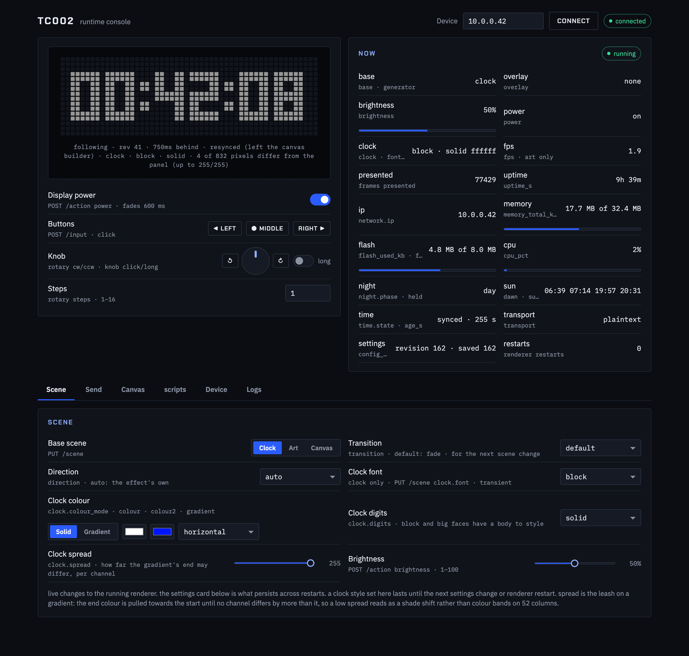
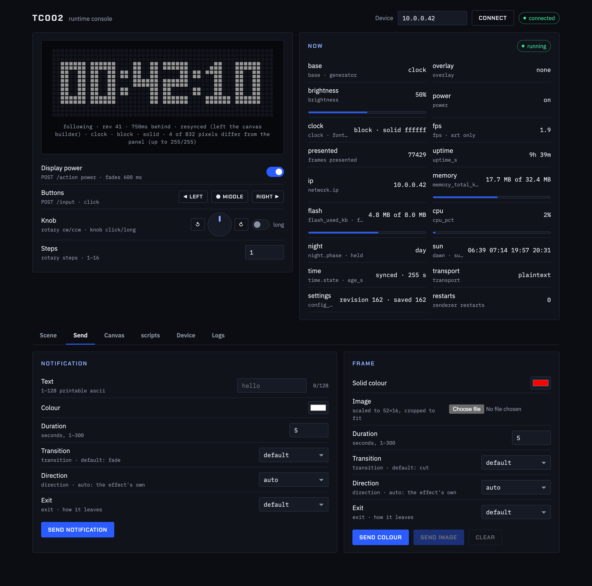
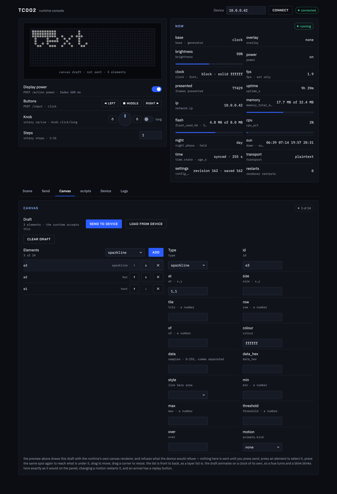
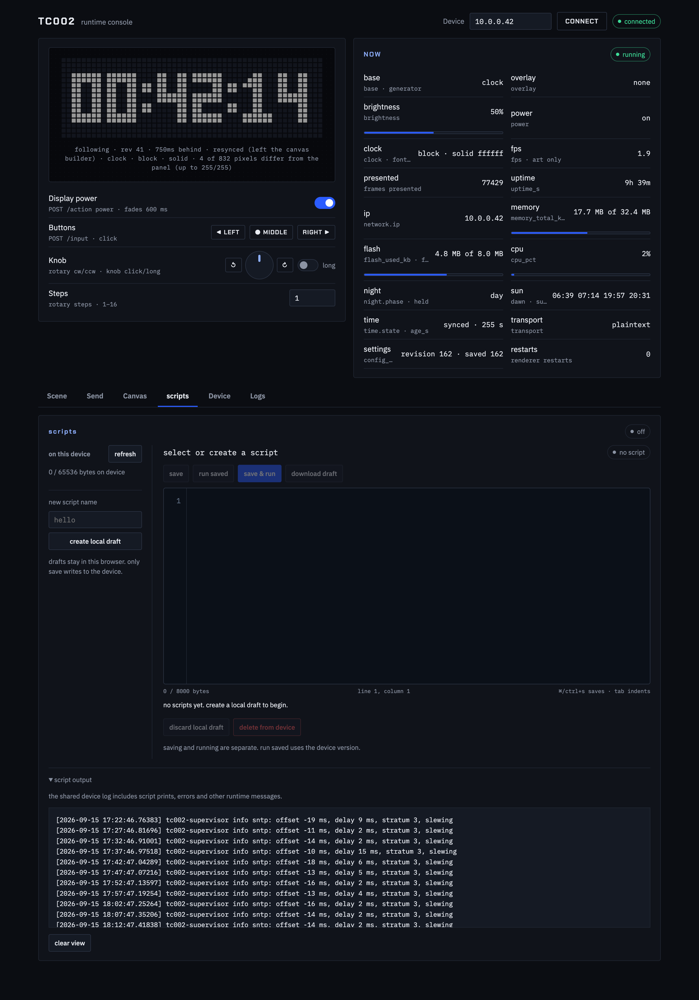
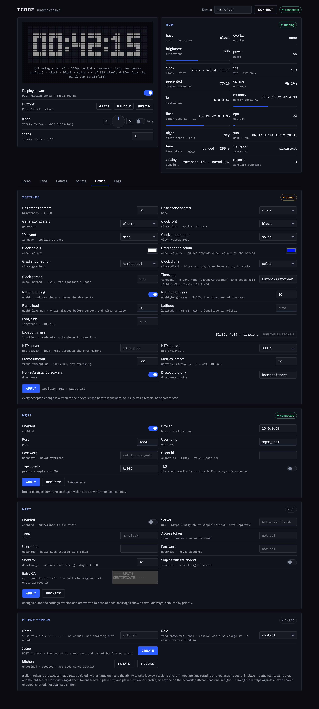
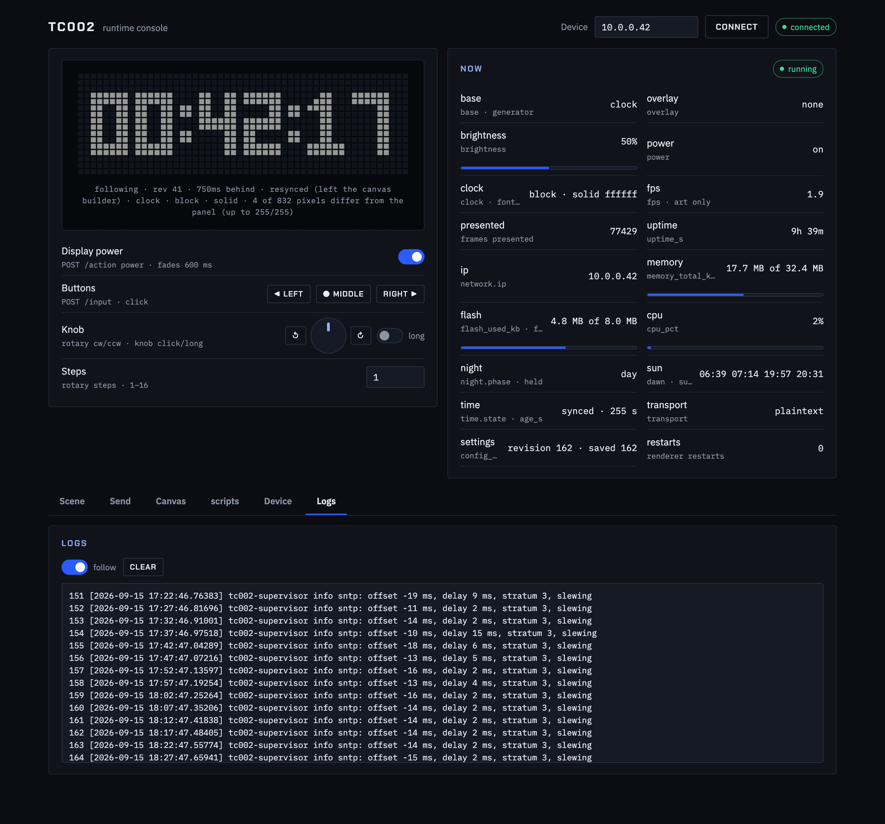

# tc002-customisation

customising and controlling the [ulanzi tc002](https://www.ulanzi.com/en-eu/products/tc002-pixbar-smart-pixel-clock-ii)
pixel clock over its local network, without the ulanzi studio desktop app.

the tc002 runs linux on a sigmastar ssd21x soc and exposes an unauthenticated
http api on port 80 plus root `adbd` on port 5555. everything here talks to
those directly, so you can set the device up, control it, and drive the display
without installing anything from ulanzi.

**the repo is two projects about one device, and it is worth knowing which one
you are reading.** the first controls the clock as it ships. the second replaces
the software on it entirely — and, since 2026-09-15, is flashed to the device's
`res` partition and boots on its own. while the replacement runs, the stock app
is not running, so the stock http api, the built-in apps and the ulanzi cloud
client are all gone. nothing here is a modification of ulanzi's application:
it is a different program using the same hardware.

everything was arrived at by reverse engineering a retail unit — no vendor
documentation, no source, no sdk. where a claim here is a measurement it says
so, and where something was inferred and later turned out to be wrong, the wrong
version is struck through rather than deleted, so anyone who read it can find
out they were misled.

note: this is beta software and changes to APIs / logic / file formats have the
potential to break between commits. patches welcome 🫠

### for the stock firmware

what ulanzi ships, driven from your own machine instead of ulanzi studio:

- **the http api on port 80**, decoded endpoint by endpoint — scenes, the nine
  built-in apps, custom app frames, brightness, wifi, the lot. unauthenticated,
  so anything on the network can drive it.
- **mqtt**, for the same display control through a broker you run.
- **`tc002-adopt.py`**, which finds a factory-fresh clock on its setup ap and
  joins it to your wifi, replacing ulanzi studio's onboarding.
- **`panel/`**, a browser console for the stock app (the stock ui is
  chinese-only).
- **`tc002-ntp-patch.py`**, which makes the clock sync from your own ntp server
  as often as you like, by patching the vendor library in tmpfs — nothing in
  flash, gone on a power cycle.
- **`mqtt-check.py`** for broker credentials, and **`tc002-update-img.py`**,
  which inspects, unpacks and rebuilds the vendor's `update.img` container.
- the write-up of **what the device sends to ulanzi's cloud**, in plain http,
  and how to stop it.

### for the replacement runtime

`runtime/` is a from-scratch replacement for the vendor application: seven
armv7 binaries in zig — six static, and the audio daemon dynamic because it
dlopens the vendor's own `libmi_ao.so` — with no libc at all in five of them,
running as a supervisor
plus a renderer, a network daemon, an ntfy subscriber, an audio daemon and a
berry script vm. it owns the panel, the buttons and the knob, and serves an
authenticated api of its own. around it:

- **`tc002-flash.sh`**, which installs it: backs up the `res` partition, refuses
  to continue unless the backup unpacks, prefers the usb cable to wifi, and puts
  a notice on the panel while the flash runs. the only thing here that writes to
  flash.
- **`tc002-mkimage.sh`** and **`tc002-mkbusybox.sh`**, which build the image and
  the static busybox it needs (the vendor's own has no `udhcpc`).
- **`panel-v2/`**, a browser console for the runtime, including a canvas builder
  and a berry script editor, with the device's own renderer compiled to wasm so
  the preview draws the device's pixels rather than an approximation of them.
- **`api-client-v2/`**, a go command-line client for the runtime's `/api/v1`.
- **`tc002ctl.py`** for driving the api by hand, and **`tc002-run.sh`** /
  **`tc002-up.sh`** for volatile development installs over adb.
- **`led/`** and **`led-zig/`**, standalone generative-art renderers that talk
  to the panel over spi directly — the experiments the runtime's renderer grew
  out of.
- **`FINGERPRINTS.md`**, checksums from a real unit, so you can tell whether
  your device matches the one all of this was measured on before you flash
  anything. it will not always match.

## what's here

docs, one topic each:

| doc | what it covers |
|-----|----------------|
| [`CANVAS.md`](CANVAS.md) | canvas mode, in pictures: every font, numeral, icon and drawing primitive the runtime offers, and the animations as recordings — each one a photograph of the panel rather than a drawing of it |
| [`CLOUD.md`](CLOUD.md) | what the device sends to ulanzi's cloud, how it authenticates, and why that's a problem |
| [`CUSTOM-APP.md`](CUSTOM-APP.md) | the custom-app frame payload shared by http and mqtt: text, draw primitives, bitmaps, gifs, lifecycle |
| [`DEVICE.md`](DEVICE.md) | living with the device: the stripped busybox, root adb, flashing and recovery, and how it keeps time. the hardware inventory itself is in this readme under [hardware](#hardware) |
| [`FINGERPRINTS.md`](FINGERPRINTS.md) | checksums from a real unit — every partition, the `res` squashfs superblock, and the files a flash depends on — so you can tell whether your device matches the one these notes were written against before you write to flash. it will not always match: the unit here shipped with an `update.img` on its own udisk that is an older revision than the `res` it runs |
| [`FIRMWARE.md`](FIRMWARE.md) | the `update.img` container (decoded, no signature), the vendor flasher and what it checks, `zkdaemon`'s boot check and reset key, the loader's order of operations, and how the runtime came to be **flashed and booting from `res`**: the boot machinery it needed, the first-flash sequence that actually worked, the recovery routes, and the corrections to earlier guesses that cost real time |
| [`HTTP-API.md`](HTTP-API.md) | the local http api on port 80: conventions, cors behaviour, and every endpoint with its request fields, response shape, error messages and how it was established |
| [`KERNEL.md`](KERNEL.md) | what the 4.9.84 kernel was built with and what it was built without: filesystems, the network stack, which syscalls are real and which return `ENOSYS`, the drivers that are bound and the ones that are not, and the kernel services worth using that nothing uses yet |
| [`LED-SPI.md`](LED-SPI.md) | how the led matrix is really driven (spidev0.0 + a gpio latch, 3072-byte frames), how to take it over, and the native 60 fps renderer in `led/` |
| [`MQTT.md`](MQTT.md) | driving the 52×16 display over a broker you control |
| [`RUNTIME.md`](RUNTIME.md) | the custom runtime in `runtime/` that replaces the stock app while it runs: how it hooks the boot chain, the supervisor / renderer / network daemon split, scenes and controls, its own authenticated http and mqtt api, what has been measured and what is still missing |
| [`SCRIPTING.md`](SCRIPTING.md) | running berry scripts on the device: the `tc002` and `panel` api, events from the buttons, mqtt and ntfy, drawing and the sixty-frame-a-second stream, the script store, and what a script is not allowed to do |
| [`SECURITY.md`](SECURITY.md) | every security observation in one place, with mitigations |
| [`SETUP.md`](SETUP.md) | the setup-ap, discovery and adoption flow that replaces ulanzi studio |

tools:

| file | what it is |
|------|-----------|
| [`tc002-adopt.py`](tc002-adopt.py) | discover tc002 devices on the lan and join a factory-fresh one to wifi — replaces ulanzi studio for setup |
| [`panel/`](panel/) | an english web control panel for the device (the stock ui is chinese-only) |
| [`mqtt-check.py`](mqtt-check.py) | verify mosquitto broker credentials from the raw mqtt connack code |
| [`tc002-ntp-patch.py`](tc002-ntp-patch.py) | make the clock sync every n minutes instead of every 2 h, and/or from your own ntp server — patches the app library in tmpfs, nothing in flash |
| [`runtime/tools/tc002-flash.sh`](runtime/tools/tc002-flash.sh) | flash an `UPDATE.img` to the `res` partition: backs up `mtd3` first, refuses to continue unless the backup unpacks, prefers usb, and puts a notice on the panel. the only thing here that writes to flash |
| [`runtime/tools/tc002-mkimage.sh`](runtime/tools/tc002-mkimage.sh) | assemble that image from your device's own `res` plus the runtime, the bootstrap, busybox and the boot scripts |
| [`runtime/tools/tc002-mkbusybox.sh`](runtime/tools/tc002-mkbusybox.sh) | build the static armv7 busybox the image needs, from a pinned upstream tarball — the vendor's own has no `udhcpc` |
| [`tc002-update-img.py`](tc002-update-img.py) | inspect, unpack and build the device's `update.img` (the `res` partition squashfs in the vendor's `ZKSWEV1.0` container): `inspect` runs the same checks the flasher does, `pack` rebuilds the vendor image byte for byte. see [`FIRMWARE.md`](FIRMWARE.md) |
| [`api-client-v2/`](api-client-v2/README.md) | `tc002`, a go command-line client for the custom runtime's `/api/v1` — the scriptable counterpart to `panel-v2/`. not for the stock firmware |
| [`led/`](led/) | popsquares generative art running on the device at 60 fps, straight to the panel over spi — static armv7 binary built with zig, plus an adb start/stop wrapper |
| [`led-zig/`](led-zig/) | full-parity idiomatic zig renderer with typed modules, colocated tests, native dry-run, static armv7 build, and adb wrapper |
| [`runtime/`](runtime/) | the custom runtime: a supervisor, a renderer (three bases — clock, art and canvas — with popsquares, plasma and cube as the art generators, plus notifications, raw frames, transitions, the on-panel menu, the buttons and the knob), an unprivileged network daemon with a bearer-authenticated `/api/v1` and an mqtt client with home-assistant discovery, a sandboxed berry script interpreter ([`SCRIPTING.md`](SCRIPTING.md)), and a speaker daemon, plus the bootstrap the vendor loader runs and a memory-audit tool. zig 0.16, static armv7, flashed to the `res` partition (and runnable from `/tmp` for development), and no libc in anything but the script interpreter. reference in [`RUNTIME.md`](RUNTIME.md) |
| [`panel-v2/`](panel-v2/) | the same idea for the custom runtime in [`RUNTIME.md`](RUNTIME.md): a local proxy that holds the api tokens and a page that drives scenes, clock fonts and colours, notifications, frames, settings, mqtt, remote presses, display power and the log ring, with a live 52×16 preview that runs the runtime's own scene code, cross-compiled to webassembly by `zig build wasm` (so the preview cannot drift from the device) |

related: [pixdeck](https://github.com/cailurus/PixDeck) is a working stock-firmware
client for the custom-app protocol over both http and mqtt — its `pixbar_core.py`
and `plugins/` are the source for most of [`CUSTOM-APP.md`](CUSTOM-APP.md).

## quick start

**from the box to the replacement runtime, in one command**

```bash
./tc002-onboard.sh --wifi-ssid <your 2.4 GHz network>
```

That finds the clock — adopting it off its `U-Clock` setup AP if it is still
factory-fresh — checks it is the hardware these notes describe, records a
fingerprint, takes a **verified backup of the `res` partition**, and builds your
image from it. It writes nothing to flash; it prints the one command that does.
Add `--flash` to go all the way. See [`SETUP.md`](SETUP.md).

A release tarball needs no compiler — only `adb`, `python3` and
`squashfs-tools`. Build one with `./tc002-mkrelease.sh`; the armv7 binaries go in
prebuilt.

> **Your image is built on your machine, and cannot be shipped prebuilt.** The
> `res` partition carries the vendor application `lib/libzkgui.so`, and that file
> **differs between units** — the two clocks measured for these notes run
> application builds sixteen days apart. A prebuilt image would install another
> device's vendor app onto yours. So the image is assembled from a dump of your
> own device, and that dump is also your way back.
> See [`FINGERPRINTS.md`](FINGERPRINTS.md).

everything uses apple's `/usr/bin/python3` deliberately — see
[the local network gotcha](#a-note-on-macos) below.

**find a device already on your wifi**

```bash
/usr/bin/python3 tc002-adopt.py discover
```

it listens for the device's own udp broadcast (port 55555, about once a
second) and confirms over http, so it answers in a few seconds. from another
vlan, or if your ap filters broadcasts, it falls back to a subnet sweep
(`--no-listen --subnet 10.0.0` forces that).

**control it in english**

```bash
cd panel && /usr/bin/python3 serve.py 8777
# open http://127.0.0.1:8777  (override the target with ?host=<device-ip>)
```

the page finds the device by itself: `serve.py` listens for the udp/55555
broadcast in the background and the page picks the address up from it (or
offers a list if there are several; **find** re-checks). `--no-discover`
turns that off, and the address can always be typed. the panel covers
display/general settings, mqtt (with live connection status),
the nine built-in apps (enable, and jump to any that's on), custom apps, the
physical buttons and knob, and led current-gain calibration behind a
confirmation. a 52×16 preview at the top simulates the clock face the way the
device draws it, honouring the timezone, time format, week-start and weekday
settings; the firmware has no way to report what it is actually showing. it
reads current values and merges edits into the full object before posting, so
unshown fields are preserved. type is loaded from google fonts and falls back
to system faces offline.


(screenshots are against a stand-in device, so the serial, mac and ssid read as
placeholders. the host field accepts `host:port`, which is how the stand-in
was pointed at.) `serve.py` serves the page and proxies
`/api/<device-ip>/<endpoint>` through to the device, so the browser only ever
talks to its own origin: the device only returns cors headers on preflights
and 404s, never on real 200 responses, so a browser can't read from it directly
and a plain `http.server` will not work (see the
[cors note](HTTP-API.md#http-api)).

**control the custom runtime**

```bash
panel-v2/start-panel.sh            # device attached over adb: tokens pulled, address read from wlan0
panel-v2/start-panel.sh <device-ip> --open   # or name the device; --open launches the browser
panel-v2/start-panel.sh --mock     # no device: mock-device.py plus the proxy, for a look around
```

`start-panel.sh` prints the console url (`http://127.0.0.1:8777/?host=<device-ip>`)
and runs the proxy until ctrl-c; `--port`, `--token-file` and `--serial` cover
the rest. by hand it is:

```bash
adb pull /data/tc002/state/credentials/tokens tokens # or let serve.py do it with --adb-pull
cd runtime && zig build wasm && cd ..                # the preview renderer; start-panel.sh does this for you
cd panel-v2 && /usr/bin/python3 serve.py 8777 --token-file ../tokens
# open http://127.0.0.1:8777/?host=<device-ip>
```

only for a device running the runtime in [`RUNTIME.md`](RUNTIME.md); the stock
app's console is `panel/`. the tokens live on the persistent partition, so a
pulled file keeps working across reboots until a factory reset; `--adb-pull`
tries that path and falls back to `/tmp/tc002/credentials/tokens`, where a
runtime that could not use `/data` keeps them. the address is typed or given as `?host=`: the
runtime does not broadcast on udp/55555. `serve.py` serves the page and
proxies `/api/<device-ip>/v1/<endpoint>` to the device's `/api/v1/<endpoint>`,
adding the bearer token the route needs, so the browser never holds a token
and only talks to its own origin. `--adb-pull` takes `--serial <adb-serial>`
to pick the device when several are attached. the preview is a **replica, not a
simulation**: `zig build wasm` cross-compiles the runtime's own scene code to
webassembly, so the page and the device run the same renderer and cannot drift.
it follows the device's *triggers* rather than its state — `GET /events` streams
every statement the device applies, whoever issued it (the api, a button, the
knob, mqtt), and the page applies the same statement to its own arbiter and
checks it landed on the same revision. the mirror deliberately runs 750 ms
behind, so a statement is played at the instant it actually happened rather than
when it was heard about. `/status`, `/config` and `/canvas` bootstrap it and
recover it: a statement that does not land on the device's revision means one was
missed, and the page resyncs. `/screen` is no longer the steady-state path — it
is a "check against the panel" button. the javascript port this replaced was
deleted in `451f32e`. the controls card drives the physical buttons, knob and
rotary remotely through `/input`; the scene card's power switch fades the
display through `/action`. the page is a fixed hero, the preview with the
readings and the controls that act on the device now, above six tabs: scene,
send, canvas, scripts, device and logs. the scene tab shows the controls of the scene that is
showing, so a clock face is not in the way while art runs, and a generator's
own parameters are built from the table it declares in `/scenes`, which means a
new generator arrives with working controls. `mock-device.py` is a stand-in for
developing without a device.



the caption under the preview is the honest one: it names the revision it is
following, how far behind it is, and how many of the 832 pixels differ from the
frame the device last returned.

the send tab puts a notification or a single frame on the panel — a colour, or
an image scaled to 52×16 — each with its own duration, transition, direction
and exit:



the canvas tab builds a canvas document element by element and draws the draft
with the runtime's own renderer, so the preview is what the panel would show;
the list is front to back, like a layer list, and nothing reaches the device
until send is pressed:



the scripts tab is the berry editor, with the device's byte budget, the scripts
already stored on it, and the shared device log as the output pane. it is shown
here the way a device with no scripts on it looks:



the device tab holds the durable settings, the night dimming schedule with
the place it follows the sun from, the broker, ntfy and the client tokens:



and the logs tab is the device's log ring, followed live:



(these are a real device. the address, the broker, the ntp server, the mqtt
username and the token name are replaced in the pictures; the timezone, the sun
times and the readings are not.)

they went stale once because nothing regenerated them, so there is a tool:

```bash
/opt/homebrew/bin/node --no-warnings panel-v2/screenshot.mjs <device-ip> --token-file tokens
```

it drives the same headless chrome the layout tests use, against the same
proxy, redacts each tab immediately before it shoots and puts the real address
back afterwards. it refuses to run without a token rather than photograph a
dead console. `--mock` points it at `mock-device.py` for a shape check, and
`--no-redact` turns the substitutions off for a local look.

**adopt a factory-fresh device**

a device with no stored wifi credentials hosts a wpa2 ap called `U-Clock` and
serves `192.168.1.x`. join that network, then:

```bash
/usr/bin/python3 tc002-adopt.py adopt --ssid <your-wifi>
```

the full flow is in [`SETUP.md`](SETUP.md).

**verify your mqtt broker credentials**

```bash
/usr/bin/python3 mqtt-check.py <broker-ip> 1883
```

prompts for the password with echo off so it never reaches a transcript or
shell history. `code=0` means valid. note that mosquitto returns `5` (not
authorized) rather than the spec's `4` for bad credentials, so treat `5` as
"wrong username/password".

**make the clock sync more often**

```bash
/usr/bin/python3 tc002-ntp-patch.py apply -s <device-ip> --period 10
```

the stock firmware syncs every 2 h and the crystal gains about 70 ppm, so
the seconds run visibly ahead before each sync. this pushes a patched copy of
the app library into tmpfs and bind-mounts it over the stock one; add
`--server <ip>` to point it at your own ntp server instead of the seven
hardcoded ones. it costs ~7.5 mb of the device's ram, is gone after a power
cycle, and `revert` undoes it now. details in [`DEVICE.md`](DEVICE.md#time).

## what's been established

the device:

- **soc / os** — sigmastar ssd21x, 2 × cortex-a7 at 1 ghz, 64 mb dram (~35 mb
  for linux), 32 mb spi nor, linux 4.9.84, squashfs root. the app layer is the
  flythings stack (`zkdaemon` / `zkdisplay` / `zkgui`). full inventory under
  [hardware](#hardware); shell and flashing in [`DEVICE.md`](DEVICE.md)
- **http api (port 80, no auth)** — read/write of every setting via json
  endpoints (`getConfig`/`setConfig`, `getMqttConfig`/`setMqttConfig`,
  `getToolsConfig`, `getCalendar`, `getSocial`, `setWifiConfig`,
  `setLedRegister`, and destructive `update`/`resetConfig`), plus the display
  itself via `api/custom` / `api/customList`, and remote navigation via
  `switchApp` / `switchDiyApp` / `keyEvent` — no broker needed.
  ([`HTTP-API.md`](HTTP-API.md))
- **adb (port 5555)** — over wifi, and ~~usb is mass-storage~~ **✗ that was
  wrong: adb over the usb cable works too**. it does not survive a reboot with
  the cable in, for a reason that cannot be fixed on the device
  ([`DEVICE.md`](DEVICE.md#what-happens-to-usb-across-a-reboot)). gives a **root** shell,
  though busybox is stripped to almost nothing and `/data` is the only
  persistent writable mount. ([`DEVICE.md`](DEVICE.md))
- **mqtt** — the other way to drive the 52×16 display without ulanzi studio;
  custom-app topic `[prefix]/custom/[app]` with the same `{duration,text,image,draw}`
  payload as `api/custom`. ([`MQTT.md`](MQTT.md), [`CUSTOM-APP.md`](CUSTOM-APP.md))
- **setup / discovery** — factory-fresh devices come up as the `U-Clock`
  softap on `192.168.1.1`; `POST /setWifiConfig` joins them to a network. once
  joined, the device broadcasts `Ulanzi TC002 <tail>:<mac>:<serial>:<flag>` to
  udp/55555 every second, which is how ulanzi studio finds it.
  ([`SETUP.md`](SETUP.md))
- **time** — no rtc; the app's own sntp client steps the clock from seven
  hardcoded ntp ips (four in china) at boot and every 2 h, and the crystal
  runs ~70 ppm fast, so the seconds drift visibly between syncs. no api for
  any of it, but `adb shell date -s` works and
  [`tc002-ntp-patch.py`](tc002-ntp-patch.py) changes the period and the
  servers in place. ([`DEVICE.md`](DEVICE.md#time))
- **cloud** — the device registers itself with `api.ulanzistudio.com` over
  plain http and keeps a per-device secret key plus a bearer/refresh token pair
  in `setting.ini`. weather, social counts, calendars and the update check all
  go through that api, and caldav credentials are sent to it for server-side
  fetching. ([`CLOUD.md`](CLOUD.md))

security caveats worth knowing before you put one on your main network: no auth
on anything, writes forgeable from any web page you visit (the device ignores
`Origin`), root adb with no pairing, the wifi psk stored in cleartext in a
world-readable file on the device, and all cloud traffic (calendar passwords
included) sent unencrypted. an isolated iot vlan/ssid is the sensible
home for it. full detail in [`SECURITY.md`](SECURITY.md).

## hardware

everything below was read off a running unit (`/proc`, `/sys`, the device
tree, the kernel command line, module and firmware listings, and strings in
the app library) unless marked *spec*, which means ulanzi's product page.
the case was not opened.

### compute

| | |
|---|---|
| soc | sigmastar **ssd21x** ("pioneer3" family, chip id `0xf5` rev 1, board string `PIONEER3 SSC021A-S01A-S`). the firmware calls it `ssd21x_ulanzi_I008` |
| cpu | **2 × arm cortex-a7** (armv7-a, part `0xc07` r0p5), neon, vfpv4, lpae, smp |
| clock | **1.0 ghz fixed**: the device tree has a single operating point (1 000 000 khz @ 1.0 v) and no cpufreq driver is bound. core vid selects 0.9 v / 1.0 v |
| dram | **64 mb in-package**, 62 mib mapped to the kernel. of that, 24 mib is reserved for sigmastar's media heap (`mma_heap`) and 3 mib for a framebuffer, leaving **~35 mib for linux** (`MemTotal` 36 240 kb). ~~~14 mib is free~~ **measured `MemAvailable` is 12,552 kb** with the stock app running, 16,084 kb with the custom runtime ([`RUNTIME.md`](RUNTIME.md)) |
| load | the stock app keeps the two cores at a load average of about 3 while idle, so there is little headroom for anything running alongside it |
| thermal | no thermal zone or temperature sensor is exposed |
| kernel | linux 4.9.84 smp preempt, build #1624, compiled 2026-05-27 with openwrt gcc 9.1.0. console on `ttyS0` at 115200 (whether pads are reachable was not checked) |
| platform | flythings v2.1 ("zkos") from zkswe, easyui 2.4.0, system 2.6.2, build `20260527` git `b8c8ecf`. app `1.1.1`, mcu `V1.0.17` |

### storage

**32 mib spi nor flash**, one chip, eight partitions. no nand, no emmc (the
soc has controllers for both; the nand node is disabled and nothing is on
the emmc bus). there is no sd slot: the soc's single sd/mmc slot is
configured for sdio and carries the wi-fi chip. the "tf card" in the
flythings sdk docs refers to zkswe's dev boards, not this device; the empty
`/mnt/extsd` mount point is a leftover from that sdk.

| mtd | name | size | filesystem | mounted |
|----:|------|-----:|------------|---------|
| 0 | `BOOT0` | 320 kib | bootloader (ipl) | — |
| 1 | `KERNEL` | 1.9 mib | kernel image | — |
| 2 | `rootfs` | 4.3 mib | squashfs, read-only | `/` (3.5 mib used, full) |
| 3 | `res` | 8 mib | squashfs, read-only | `/res` (2.8 mib: app library, web ui, fonts, bt tools) |
| 4 | `config` | 704 kib | squashfs, read-only | `/config` (kernel modules, board ini) |
| 5 | `MISC` | 256 kib | raw | — (pq/fbdev config read at boot) |
| 6 | `data` | 8 mib | **jffs2, read-write** | `/data` (340 kib used; the only persistent writable space) |
| 7 | `UDISK` | 8.5 mib | vfat, read-only from linux | `/mnt/storage` (holds `update.img`, and on this unit that copy is an **older** firmware than the `res` it shipped running — see [`FINGERPRINTS.md`](FINGERPRINTS.md)). ~~this is what the usb-c port exposes as a drive~~ **✗ wrong: the usb gadget is adb, not mass storage** |

everything else (`/tmp`, `/dev`, `/mnt`, `/misc`) is tmpfs, 16 mib max each.

### display

| | |
|---|---|
| panel | **52 × 16 = 832 rgb leds**, square pixels, white-balanced by a per-channel current-gain register (`0x16`, 0–63, default 30) in the led driver |
| controller | a **separate pixel mcu** (firmware `V1.0.17`, protocol class `PixelMcuProto`) sits between the soc and the leds. the soc never touches the leds directly |
| frame path | soc → **spi0** (`sstar,mspi`, dma, `/dev/spidev0.0`, mode 0, 10 mhz) → mcu, with **`GPIO_35`** as a frame latch. a frame is 3072 bytes (16 rows × 192), ~~~2.5 ms on the bus~~ **measured at 5 ms** (the 2.5 is the byte arithmetic; the rest is unaccounted for); the stock app caps at one frame per 15 ms (~66 fps). the mcu double-buffers, so the panel lags one frame. full detail in [`LED-SPI.md`](LED-SPI.md) |
| control path | soc ↔ mcu over **uart1** (`/dev/ttyS1`, 115200 / 9600). commands seen in the app: `queryMcuVersion`, `queryBatteryPower`, `queryUsbState`, `queryMicValue`, `setAutoMicReport`, `powerOff`, `queryLedRegister`, `setLedRegister`, plus a handshake + crc32 block-upload path (`updateMcu`) for reflashing the mcu |
| gain read-back | the mcu supports `queryLedRegister`; only the http layer lacks a read endpoint |
| unused | the soc's own display pipeline is still alive from the flythings sdk: `/dev/fb0` (640 × 480, 32 bpp, "spilcd"), an hdmi-tx node, a pwm backlight node and a vsync interrupt firing constantly, all driving nothing |

### wireless

| | |
|---|---|
| chip | **aicsemi aic8800dc** wi-fi + bluetooth combo (driver `aic8800_fdrv` / `aic8800_bsp`, firmware `fmacfw_*_8800dc_h_u02`) |
| wi-fi | 2.4 ghz only (*spec*), over **sdio** (id `c8a1:c08d`, `aicwf_sdio` on `mmc0`). `wpa_supplicant` with `nl80211`; a `p2p0` interface also exists. station mode normally; ap mode (`hostapd` + `dnsmasq`) for setup |
| bluetooth | ble 5.2 (*spec*), over **uart** (`/res/bin/hciattach -n ttyS3 aic` → `hci0`). a gatt server binary ships in `/res/bin`; what it advertises was not explored |
| ethernet | the soc has a mac (`emac0`); disabled, no phy |

### inputs

| | |
|---|---|
| knob | rotary encoder on **gpio 10 / 11** (edge interrupts `knob_a` / `knob_b`, driver `zkswe,ssd-knob`, input device `knob_key`) |
| buttons | **four polled gpio keys** (`gpio-keys-polled`, 20 ms poll, active-low, 5 ms debounce). there are three buttons across the top and the knob's own push — there is no up/down/left/right pad, despite what the device tree calls them. **the device tree's names are not positions**, so the mapping below is the one that matters; it is read from the device tree on the unit and matches what the runtime measured from key presses |
| ↳ which is which | gpio 31 `gpio-keys-up` → `KEY_UP` (103) → **the knob's push**; gpio 32 `gpio-keys-down` → `KEY_DOWN` (108) → **the left button**; gpio 33 `gpio-keys-left` → `KEY_LEFT` (105) → **the middle button**; gpio 34 `gpio-keys-right` → `KEY_RIGHT` (106) → **the right button**. the custom runtime's default keymap is exactly these four codes (`runtime/src/input/evdev.zig`), overridable with `--keymap`. the soc's matrix-keypad block is disabled |
| microphone | present; the app reads a **level** from the mcu (`queryMicValue` / `setAutoMicReport`) for the sound-reactive app. the soc's own mic input is configured in the device tree but is not what the app polls |
| adc | the soc's sar adc is enabled; what it measures was not established |

### audio

speaker driven by the soc's audio block (`sstar,audio`, `mi_ao`, dma) with an
**amplifier-enable on gpio 9**. volume is 0–6 in the api. there is no alsa; the
sigmastar mi api is used instead.

### power

| | |
|---|---|
| battery | 3.7 v, **3600 mah, 13.32 wh** li-ion (*spec*); up to 2 h at maximum brightness (*spec*) |
| charging | **usb-c, 5 v ⎓ 3 a** (*spec*), or the pogo-pin charging dock. *measured 2026-09-14:* the dock registers on the same `vin` the mcu reports for usb-c, so undocking reads as loss of usb power |
| monitoring | done by the mcu: the app polls pack millivolts and `vin` (usb present). firmware thresholds: **low battery below 3600 mv**, **emergency below 3550 mv** → 30 s countdown → shutdown (skipped while on usb power) |
| shutdown | the custom runtime reproduces those thresholds — see [`RUNTIME.md`](RUNTIME.md#the-low-battery-shutdown) — and powers off through the mcu's own `powerOff` command rather than halting the soc, which would leave the rails up |
| usb | the soc has both an ehci **host** (with `vold` ready to mount a stick at `/mnt/usb1`, used for factory-test configs) and a device controller (`Sstar-udc`, msb250x). the gadget is configured as **adb** (`18d1:d002`), not mass storage. ~~the otg controller boots in `usb_host` mode, so nothing enumerates until `usb_device` is written to otg_role~~ **✗ corrected: it boots in device mode and enumerates on its own; the kernel's `zkswe,sstar-otg` driver then flips the port to host for ~3 s, and that excursion is what strands the host's view of the port across a reboot** ([`DEVICE.md`](DEVICE.md#what-happens-to-usb-across-a-reboot)) |
| rtc | **none usable**: the soc's rtc block is enabled in the device tree but no driver is bound, so there is no `/dev/rtc` and the clock is set purely by sntp ([`DEVICE.md`](DEVICE.md#time)) |

### also on the soc, unused

i2c0 / i2c1 (disabled), spi1 (disabled), a camera pipeline (csi / isp / vif,
enabled by the sdk, no sensor), a watchdog (enabled), and a second uart.

### physical (*spec*)

20.5 × 3.3 × 8.5 cm, about 380 g (421 g with the dock), pc plastic, with a
1/4-inch tripod thread. the dock is 19.7 × 3.1 × 1 cm. the box holds the
clock, the dock and a usb-c cable.

## a note on macos

on macos 15+ (sequoia), local network privacy gates lan access **per binary**.
apple's own binaries (`/usr/bin/curl`, `/usr/bin/python3`, `/sbin/ping`,
`/usr/bin/nc`) are exempt; homebrew- and third-party-installed binaries
(including a properly signed `adb`) are blocked until the **terminal app** is
granted permission, and the denial surfaces as a misleading network error,
never a permission error:

| tool | symptom |
|------|---------|
| `adb connect` | `failed to connect to '<ip>:5555': No route to host` |
| `nmap` | `Host seems down` / all ports `filtered (host-unreach)` |

that split is the diagnostic: if `/usr/bin/curl` works and
`/opt/homebrew/bin/nmap` does not, it is the permission, not the network. it is
also why the tools here call `/usr/bin/python3` explicitly.

**fix:** system settings → privacy & security → local network → enable your
terminal app, then **fully quit and relaunch it** (the permission is evaluated
at process launch; a new tab is not enough).

```bash
open "x-apple.systempreferences:com.apple.preference.security?Privacy_LocalNetwork"
```

## status

- discovery, the control panel, the mqtt checker, and all documented read
  endpoints are **verified against a live device**.
- the `adopt` / `setWifiConfig` write path is documented from the firmware's own
  setup page but **not executed** here, since it would drop the test device off
  the network. confirm it against a factory-fresh unit before relying on it.
- the custom runtime in `runtime/` is **flashed to the `res` partition and boots
  on its own**, unattended from cold: it loads the wifi driver, brings the
  network up, exports the panel latch and draws, with no stock app involved.
  the `/tmp` path still exists and is what development uses. still no tls; the
  gap list is in [`RUNTIME.md`](RUNTIME.md#what-is-not-there-yet).
- flashing is done by [`tc002-flash.sh`](runtime/tools/tc002-flash.sh), which
  backs up `mtd3` first and refuses to continue unless the backup unpacks.
  **before flashing anything, check your unit against
  [`FINGERPRINTS.md`](FINGERPRINTS.md)** — devices differ, and the one here
  shipped with an `update.img` on its own udisk that is *older* than the `res`
  it was running, which means the reset button recovers to a downgrade.
  [`FIRMWARE.md`](FIRMWARE.md) has the sequence that worked, the boot machinery
  it needed, and corrections to several claims made along the way that turned
  out to be wrong.

## disclaimer

unofficial, reverse-engineered from a device on the local network and from the
ulanzi studio installer. not affiliated with or endorsed by ulanzi. the http api
and adb access it relies on are undocumented and may change or break in a
firmware update. you are responsible for what you do to your own hardware —
`resetConfig`, `update`, and `setLedRegister` in particular can disrupt or
degrade the device. recovery to factory firmware is holding the reset button
during power-up.

## references

- [UlanziTechnology/Ulanzi-U-Clock-TC002](https://github.com/UlanziTechnology/Ulanzi-U-Clock-TC002)
- [FlyThings ADB docs](https://zkswe.github.io/flythings-doc/en/adb_debug.html)
